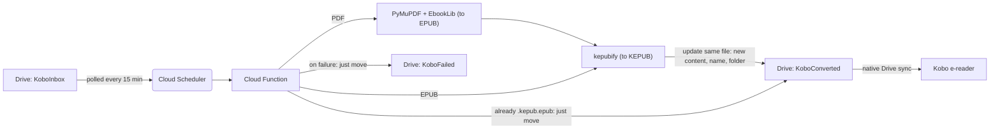

# Kobo-Google Drive pipeline; Auto-Kepub from PDF and EPUB

Drop a PDF or EPUB into a Google Drive folder. About 15 minutes later, that
same file has become a Kobo-ready `.kepub.epub`, sitting in another Drive
folder that's already synced natively to my Kobo. No app to open, no server I have to maintain and no monthly bill. Works reliably in the 1-2 months that I had it set up.

## What this does

I wanted to get a PDF to my kobo (for free!) and convert all my epub to kepub via a private personal sever as my Kobo was lagging with epub format.
My usage is light (max roughly 5MB of PDFs/EPUBs a week). I wanted it to be free, no maintenance and extremely hands-off.

What this does:
- A PDF gets its text extracted and rebuilt as a proper reflowable EPUB
- An EPUB (from either path) gets run through the format conversion Kobo
  actually wants, `.kepub.epub`, which is what unlocks accurate page
  counts, highlighting, and reading stats on the device
- Anything that fails to convert gets filed separately instead of
  vanishing or retrying forever

## Options I considered, and why I moved on from each

I already had [NickelMenu](https://pgaskin.net/NickelMenu/) installed,and stock Kobo firmware already natively syncs Instapaper, Dropbox,
and Google Drive. The only real gap was PDFs, where Instapaper requires a premium account to sync to Kobo. 

There are [excellent and free](https://send.djazz.se/) epub to kepub webapp available, and since I was experimenting with this, I decided to build this for a private sever.  I also originally wanted to have Image to text via OCR, but decided to drop it as it was a hypotheical use case and I didnt have a need for it (but it is open-sourced and entirely possible).

This went through more wrong turns than right ones before landing here. A key learning point was that all of these features are open-sourced, and anyone can build their version of this with a little curiousity and patience. That's genuinely the point of writing all of the above down.

**1. GitHub Actions writing to a public GitHub Pages site or Dropbox folder.** My first
working pipeline. Simple, free, worked fine, until privacy became a
requirement, I didn't want a public, guessable trail of what I was
reading and was already an excellent webapp available. The obvious fix, "just make the repo private", turned out to be
wrong: GitHub's own documentation says Pages sites stay publicly
reachable by URL even from a private repository, and private-repo Pages
isn't even available on the free plan. Github-Dropbox could work. I pursue it a little before asking myself a more basic question.

**2. Do I even need GitHub?** It was only
ever standing in for "a free place to run code." That's the point where
Google Drive came into serious consideration instead of Dropbox, since I
already had a Kobo linked to Drive natively and didn't want a third
service (GitHub, Dropbox) in the mix when two would do.

**3. Google Drive via normal OAuth.** Google's standard consent flow for
a personal project issues refresh tokens that expire after 7 days unless
the app goes through Google's full verification process, disproportionate
for something only I'd ever use. The fix: a **service account** with a
folder explicitly shared to it instead, sidestepping the whole
consent-screen/expiry problem entirely.

**4. Landing on Google Cloud Functions + Scheduler.** I was already using Google Cloud. Once a GCP project
existed anyway for the service account, running the code there too
was the simpler choice, not because it's objectively simpler than GitHub, but because I was already standing in Google's
ecosystem (Drive, the Kobo's native Drive link, the Google account
itself), and consolidating onto one platform beat juggling credentials
and dashboards across two. It also turned out to be the more secure
option: the function runs *as* the service account via IAM, so no key
file ever needs to be exported, stored as a secret, or trusted to a
second platform at all.

## Security

- **No exportable key exists anywhere in this design.** The Cloud
  Function runs as the service account via IAM attachment. Google issues
  short-lived tokens to it internally; nothing gets written to disk or
  pasted into a secrets manager.
- **Blast radius is bounded by folder sharing, not API scope.** The
  service account can only see the three Drive folders explicitly shared
  with it, nothing else in the Drive account is visible to it.
- **The function isn't a public endpoint.** It requires authentication;
  only a second, narrowly-scoped service account (whose only permission
  is "invoke this one function") can call it, via a short-lived OIDC
  token from Cloud Scheduler, not a shared secret.
- The underlying principle: prefer "there's nothing to steal" over
  "there's something to protect," whenever the platform gives you that
  option.

## Why this is free

- Cloud Functions (gen2) free tier covers 2 million invocations a month.
  At one run every 15 minutes, that's roughly 2,900 invocations a month
  on files a few hundred KB to a few MB in size, nowhere near the limit.
- Cloud Scheduler's free tier covers a small number of jobs per billing
  account; this uses exactly one.
- Cloud Build (once per deploy, not per conversion) has its own separate
  free monthly allowance.
- A budget alert is set on the project regardless, worth being precise
  about what that actually is: an email if spend crosses a threshold, not
  a spending cap. It doesn't stop anything by itself; the free-tier
  numbers above are what actually keeps this at $0.

## Architecture

The function authenticates to Drive using Application Default Credentials,
resolved automatically from the service account IAM-attached to it at
deploy time. No key file is loaded, generated, or referenced anywhere in
the code.

## Setup

1. **GCP project**: create one, link billing, and set a budget alert
   (Billing → Budgets & alerts), remembering it's a notification, not a
   spending cap.
2. **Three Drive folders**, flat, not nested: `KoboInbox`,
   `KoboConverted`, `KoboFailed`. Note each folder's ID from its URL.
3. **Deploy**: fill in the project ID, region, and three folder IDs at
   the top of `deploy.sh`, then run it (Google Cloud Shell, in the
   browser, is the easiest place to do this, no local install needed). It
   enables the required APIs, fixes the Cloud Build permission proactively,
   creates the service account (no key file), pauses so you can share the
   three folders with that service account's email (Editor access),
   deploys the function, creates a separate invoker identity for Cloud
   Scheduler, and sets up the 15-minute schedule.
4. **Kobo**: link the same Google account natively (Settings, or the
   shortcut in `nickelmenu-config` if you have NickelMenu installed),
   pointed at `KoboConverted`.
5. **Use it**: drop a file into `KoboInbox`. It shows up converted in
   `KoboConverted` within about 15 minutes.

## Limitations

- You need to set up billing account in GCP and there is no way to impose a spending cap. In theory, if you have an awesome reading month and read many GB worth of books, you may be charged. But I have yet to be charged for anything. 
- Up to a 15-minute delay between upload and conversion, adjustable in
  `deploy.sh` if that ever actually matters at higher volume.
- PDF conversion is plain text extraction with no layout awareness: great
  for single-column, text-heavy PDFs, messy on multi-column
  magazine-style layouts.
- A PDF with no extractable text (e.g. a scanned image with no text
  layer) lands in `KoboFailed` rather than failing silently.

## Files

- `main.py` — the Cloud Function
- `kepubify` — the official kepubify v4.0.4 Linux binary
- `requirements.txt` — Python dependencies
- `deploy.sh` — the full `gcloud` deployment sequence, including the
  Cloud Build permission fix
- `nickelmenu-config` — native Kobo shortcuts (Instapaper, Google Drive,
  library refresh), optional, only relevant if you have NickelMenu
  installed already

## Disclaimer

This project is a hobby and experimental work. This author is not responsible for any loss, damage, or issues arising from its use.

Please review the source code and test thoroughly before deploying in any production environment.

Developed with assistance from Anthropic's Claude.
